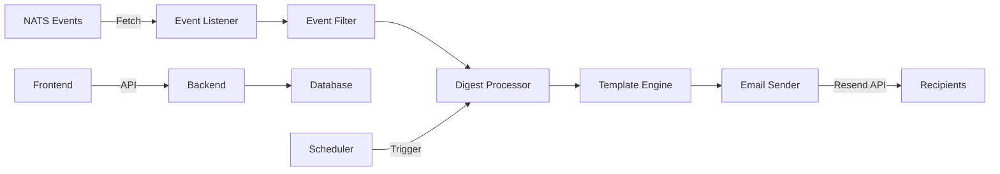

# Architecture de GS Stream Digest

## Vue d'ensemble

GS Stream Digest est construit sur une architecture moderne de microservices utilisant un monorepo géré par Turborepo. L'application suit les principes de Domain-Driven Design (DDD) et Clean Architecture.

## 🏗️ Structure du projet

```
gs-stream-digest/
├── apps/                      # Applications
│   ├── backend/               # API REST Fastify
│   │   ├── src/
│   │   │   ├── api/           # Routes et controllers
│   │   │   ├── services/      # Logique métier
│   │   │   ├── jobs/          # Tâches asynchrones
│   │   │   ├── plugins/       # Plugins Fastify
│   │   │   ├── utils/         # Utilitaires
│   │   │   └── index.ts       # Point d'entrée
│   │   ├── tests/
│   │   └── package.json
│   │
│   └── frontend/              # Application Next.js
│       ├── src/
│       │   ├── app/           # App Router (Next.js 14)
│       │   ├── components/    # Composants React
│       │   ├── lib/           # Logique client
│       │   ├── services/      # Services API
│       │   └── stores/        # State management
│       ├── public/
│       └── package.json
│
├── packages/                  # Packages partagés
│   ├── database/              # ORM et migrations
│   │   ├── src/
│   │   │   ├── schema/        # Définitions des tables
│   │   │   ├── migrations/    # Fichiers de migration
│   │   │   └── client.ts      # Client DB
│   │   └── drizzle.config.ts
│   │
│   ├── shared/                # Types et utilitaires partagés
│   │   └── src/
│   │       ├── types/         # Définitions TypeScript
│   │       └── utils/         # Fonctions utilitaires
│   │
│   └── email-templates/       # Moteur de templates
│       ├── src/
│       │   ├── renderer.ts    # Moteur Liquid
│       │   └── templates/     # Templates prédéfinis
│       └── tests/
│
├── deploy/                    # Configuration de déploiement
│   ├── docker/
│   ├── fly/
│   └── k8s/
│
└── docs/                      # Documentation
```

## 🔄 Flux de données



## 📦 Composants principaux

### 1. Backend API (Fastify)

**Responsabilités :**
- Exposition des endpoints REST
- Authentification et autorisation
- Validation des données
- Orchestration des services

**Technologies :**
- Fastify 4.28 (Framework web haute performance)
- TypeScript 5.7 (Type safety)
- Zod (Validation des schémas)
- JWT (Authentification)

**Structure :**
```
backend/src/
├── api/
│   ├── digests/       # CRUD digests
│   ├── templates/     # Gestion templates
│   ├── emails/        # Historique emails
│   ├── auth/          # Authentification
│   ├── monitoring/    # Statistiques
│   └── webhooks/      # Webhooks Resend
├── services/
│   ├── nats/          # Client NATS
│   ├── email/         # Service email
│   ├── scheduler/     # Planification
│   └── database/      # Accès DB
└── plugins/
    ├── auth.ts        # Plugin auth
    └── error.ts       # Gestion erreurs
```

### 2. Frontend (Next.js)

**Responsabilités :**
- Interface utilisateur
- Gestion de l'état client
- Intégration Supabase Auth
- Appels API

**Technologies :**
- Next.js 14.2 (Framework React)
- TypeScript (Type safety)
- Tailwind CSS (Styling)
- Radix UI (Composants)
- React Query (Cache & state)
- Zustand (State management)

**Structure :**
```
frontend/src/
├── app/               # Routes et pages
│   ├── (auth)/        # Pages publiques
│   ├── dashboard/     # Pages protégées
│   └── api/           # Route handlers
├── components/
│   ├── ui/            # Composants de base
│   ├── forms/         # Formulaires
│   └── layouts/       # Layouts
└── lib/
    ├── supabase/      # Client Supabase
    ├── api/           # Client API
    └── utils/         # Utilitaires
```

### 3. Database (SQLite + Drizzle)

**Schema principal :**

```sql
-- Digests
CREATE TABLE digests (
    id TEXT PRIMARY KEY,
    name TEXT NOT NULL,
    account_id TEXT NOT NULL,
    filters TEXT NOT NULL, -- JSON
    schedule TEXT NOT NULL,
    recipients TEXT NOT NULL, -- JSON array
    template_id TEXT REFERENCES digest_templates(id),
    last_event_uid TEXT,
    last_check_at TIMESTAMP,
    is_active BOOLEAN DEFAULT true,
    created_at TIMESTAMP NOT NULL,
    updated_at TIMESTAMP NOT NULL
);

-- Templates
CREATE TABLE digest_templates (
    id TEXT PRIMARY KEY,
    name TEXT NOT NULL,
    subject_liquid TEXT NOT NULL,
    body_html_liquid TEXT NOT NULL,
    body_text_liquid TEXT,
    is_global BOOLEAN DEFAULT false,
    created_at TIMESTAMP NOT NULL
);

-- Runs history
CREATE TABLE digest_runs (
    id TEXT PRIMARY KEY,
    digest_id TEXT REFERENCES digests(id),
    run_at TIMESTAMP NOT NULL,
    events_count INTEGER NOT NULL,
    emails_sent INTEGER NOT NULL,
    status TEXT NOT NULL,
    error TEXT
);

-- Email logs
CREATE TABLE email_logs (
    id TEXT PRIMARY KEY,
    digest_run_id TEXT REFERENCES digest_runs(id),
    recipient TEXT NOT NULL,
    resend_id TEXT UNIQUE,
    status TEXT NOT NULL,
    sent_at TIMESTAMP,
    opened_at TIMESTAMP,
    clicked_at TIMESTAMP
);

-- API Keys
CREATE TABLE api_keys (
    id TEXT PRIMARY KEY,
    user_id TEXT NOT NULL,
    account_id TEXT NOT NULL,
    role TEXT NOT NULL,
    key_hash TEXT NOT NULL,
    created_at TIMESTAMP NOT NULL
);
```

### 4. Services métier

#### NATS Event Listener
- Connexion à gs-stream-events API
- Récupération des événements depuis un curseur
- Gestion de la pagination et du rate limiting

#### Event Filter
- Filtrage par type d'événement
- Filtrage par compte et application
- Filtrage par données custom (JSONPath)
- Support des expressions complexes

#### Email Renderer (Liquid)
- Moteur Liquid avec filtres personnalisés
- Support HTML et texte brut
- Variables contextuelles
- Boucles et conditions

#### Scheduler (Bree)
- Gestion des tâches périodiques
- Support cron expressions
- Exécution en worker threads
- Retry automatique

#### Email Sender (Resend)
- Intégration API Resend
- Tracking des ouvertures/clics
- Gestion des bounces
- Batch sending

## 🔐 Sécurité

### Authentification

```
Client → Supabase Auth → JWT Token
         ↓
Client → API Request + Bearer Token → Backend
         ↓
Backend → Verify JWT → Process Request
```

### Autorisation

```typescript
// Niveaux de permission
enum Role {
  SUPERADMIN = 'superadmin', // Accès total
  ADMIN = 'admin',           // Gestion compte
  VIEWER = 'viewer'          // Lecture seule
}

// Isolation des données
function filterByAccount(user, data) {
  if (user.role === 'superadmin') return data;
  return data.filter(d => d.accountId === user.accountId);
}
```

### Protection des routes

```typescript
// Backend
fastify.get('/api/digests', {
  preHandler: requireAuth({ role: ['admin', 'superadmin'] })
}, handler);

// Frontend
export default function ProtectedPage() {
  const { user } = useAuth();
  if (!user) return <Redirect to="/login" />;
  if (user.role !== 'admin') return <Forbidden />;
  return <Page />;
}
```

## 🚀 Performance

### Optimisations Backend

- **Connection pooling** : Réutilisation des connexions DB
- **Caching** : Redis pour les données fréquentes
- **Rate limiting** : Protection contre les abus
- **Compression** : Gzip pour les réponses
- **Async/Await** : Traitement non-bloquant

### Optimisations Frontend

- **Code splitting** : Chargement à la demande
- **Image optimization** : Next.js Image component
- **Static generation** : Pages statiques quand possible
- **React Query** : Cache et deduplication
- **Bundle optimization** : Tree shaking

### Optimisations Database

- **Indexes** : Sur les colonnes fréquemment requêtées
- **WAL mode** : Write-Ahead Logging pour SQLite
- **Query optimization** : Analyse EXPLAIN
- **Connection pooling** : Réutilisation des connexions

## 📊 Monitoring

### Métriques collectées

```typescript
// Application metrics
- Request latency
- Error rate
- Active digests
- Email delivery rate
- Queue size

// Business metrics
- Emails sent/hour
- Open rate
- Click rate
- Bounce rate
- Active users
```

### Stack de monitoring

```
Application → Sentry (Errors)
            → Axiom (Logs)
            → Resend (Email metrics)
            → Custom metrics (Prometheus)
```

## 🔄 CI/CD Pipeline

```yaml
# GitHub Actions workflow
name: Deploy
on:
  push:
    branches: [main]

jobs:
  test:
    - lint
    - type-check
    - unit-tests
    - integration-tests

  build:
    - docker-build
    - push-registry

  deploy:
    - deploy-staging
    - smoke-tests
    - deploy-production
```

## 🧪 Testing Strategy

### Pyramide de tests

```
         /\
        /E2E\        5%
       /------\
      /Integration\  25%
     /------------\
    /   Unit Tests  \ 70%
   /----------------\
```

### Types de tests

1. **Unit Tests** : Logique métier isolée
2. **Integration Tests** : Composants ensemble
3. **E2E Tests** : Parcours utilisateur complet
4. **Performance Tests** : Charge et stress
5. **Security Tests** : Vulnérabilités

## 📈 Scalabilité

### Horizontal Scaling

```
Load Balancer
    ↓
┌─────────┐  ┌─────────┐  ┌─────────┐
│Backend 1│  │Backend 2│  │Backend 3│
└─────────┘  └─────────┘  └─────────┘
    ↓            ↓            ↓
    └────────────┴────────────┘
                 ↓
            Database
```

### Vertical Scaling

- Augmentation CPU/RAM selon besoins
- Database migration vers PostgreSQL
- Cache distribué avec Redis
- Queue management avec RabbitMQ

## 🛠️ Maintenance

### Logs structure

```json
{
  "timestamp": "2024-01-01T00:00:00Z",
  "level": "info",
  "service": "backend",
  "method": "POST",
  "path": "/api/digests",
  "duration": 123,
  "status": 201,
  "user_id": "usr_123",
  "account_id": "acc_456",
  "trace_id": "tr_789"
}
```

### Health checks

```typescript
GET /health
{
  "status": "healthy",
  "version": "1.0.0",
  "uptime": 3600,
  "database": "connected",
  "nats": "connected",
  "resend": "connected"
}
```

## 🔮 Évolutions futures

1. **Multi-tenancy** : Isolation complète par tenant
2. **GraphQL API** : Alternative REST
3. **Real-time updates** : WebSockets pour le dashboard
4. **Machine Learning** : Prédiction des patterns d'envoi
5. **Mobile app** : Application React Native
6. **Marketplace** : Templates communautaires
7. **Webhooks sortants** : Intégrations tierces
8. **Analytics avancés** : BI intégré

---

*Document maintenu par l'équipe d'architecture Grand Shooting*